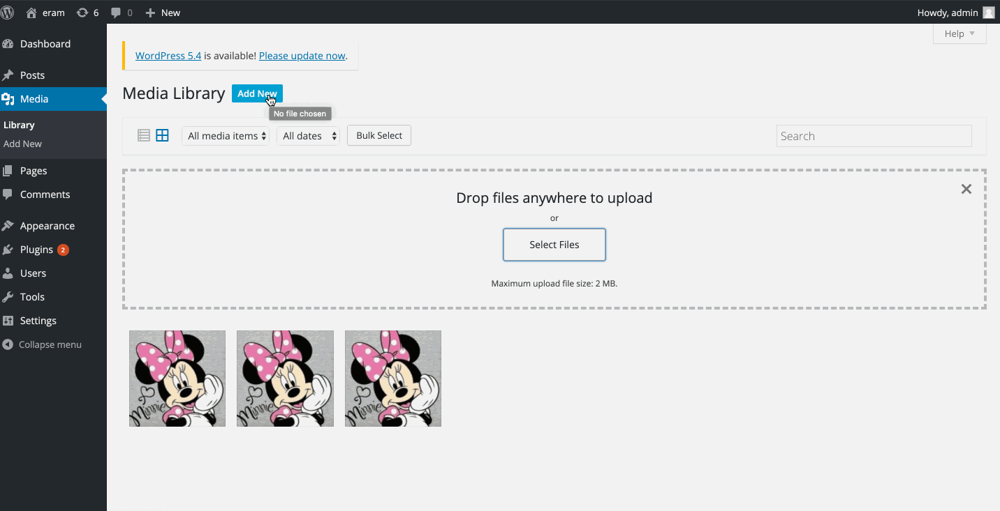

# Project 7 - WordPress Pentesting

Time spent: 6 hours spent in total

> Objective: Find, analyze, recreate, and document **five vulnerabilities** affecting an old version of WordPress

## Pentesting Report

1. (Required) Vulnerability Name or ID:  Authenticated stored Cross-Site Scripting (XSS)
  - [ ] Summary: 
    - Vulnerability types: XSS
    - Tested in version: 4.2
    - Fixed in version: 4.6.1
  - [ ] GIF Walkthrough: <br /> 
  - [ ] Steps to recreate: <br /> <ul><li>Create a post </li> <li>Add the following to the post : <script type="text/javascript">alert("Hiiii");</script> </li> <li> Publish </li> <li>Visit Post </li> </ul>
  - [ ] Affected source code:
    - [Link 1](https://core.trac.wordpress.org/browser/branches/4.1/src/wp-includes/post.php)
2. (Required) Vulnerability Name or ID : Authenticated Stored Cross-Site Scripting via Image Filename
  - [ ] Summary: 
    - Vulnerability types: XSS
    - Tested in version: 4.2
    - Fixed in version: 4.6.1
  - [ ] GIF Walkthrough: <br />
    
  - [ ] Steps to recreate: <br /> <ul><li>Upload a Image </li> <li>Add the following to the title of the image : Minnie.jpg </li><li>Visit the page </li></ul>
  - [ ] Affected source code: 
    - [Link 1](https://core.trac.wordpress.org/browser/branches/4.1/src/wp-includes/media.php)
3. (Required) Vulnerability Name or ID : Password Brute Force Attack
  - [ ] Summary:
    - Vulnerability types: User Enumeration
    - Tested in version: 4.2
    - Fixed in version: N/A
  - [ ] GIF Walkthrough: <br />
     
  - [ ] Steps to recreate: <br /> <ul><li>Install worlists and get rockyou-75.txt. Make sure rockyou-75.txt is in /home/kali/Desktop/rockyou-75.txt</li> 
  ``` 
      $ apt-get install wordlists
      $ cd \usr\share\wordlists\
      $ gzip -d rockyou-75.txt.gz 
  ```
  <li> Get Api token from https://wpvulndb.com/ </li>
  <li> use token to find users : $ wpscan --url wpdistillery.vm -e u vp --api-token <token name> </li>
  <li> use token to find password :  $ wpscan --url wpdistillery.vm -e u --passwords /home/kali/Desktop/rockyou-75.txt --api-token <token name></li></ul>
  - [ ] Affected source code:
    - [Link 1](https://github.com/WordPress/WordPress/blob/master/wp-login.php)
4. (Optional) Vulnerability Name or ID: Authenticated Stored Cross-Site Scripting (XSS) in YouTube URL Embeds
  - [ ] Summary: 
    - Vulnerability types: XSS
    - Tested in version: 4.2
    - Fixed in version: 4.7.3
  - [ ] GIF Walkthrough:  <br />
  
  - [ ] Steps to recreate: <br /><ul><li>Create a new page <li> <Add a youtube embed url such as : [embed src='https://youtube.com/embed/minnie\x3csvg onload=alert(12)\x3e'][/embed]</li><li>Publish</li><li>View Page</li></ul>
  - [ ] Affected source code:
    - [Link 1](https://core.trac.wordpress.org/browser/branches/4.1/src/wp-includes/media.php)


## Assets

List any additional assets, such as scripts or files

## Resources

- [WordPress Source Browser](https://core.trac.wordpress.org/browser/)
- [WordPress Developer Reference](https://developer.wordpress.org/reference/)

GIFs created with [LiceCap](http://www.cockos.com/licecap/).

## Notes

Setting up the project was the most difficult. Error messages while setting up where not descriptive so had to try out different solutions to issues.

## License

    Copyright 2020 Eram Manasia

    Licensed under the Apache License, Version 2.0 (the "License");
    you may not use this file except in compliance with the License.
    You may obtain a copy of the License at

        http://www.apache.org/licenses/LICENSE-2.0

    Unless required by applicable law or agreed to in writing, software
    distributed under the License is distributed on an "AS IS" BASIS,
    WITHOUT WARRANTIES OR CONDITIONS OF ANY KIND, either express or implied.
    See the License for the specific language governing permissions and
    limitations under the License.
